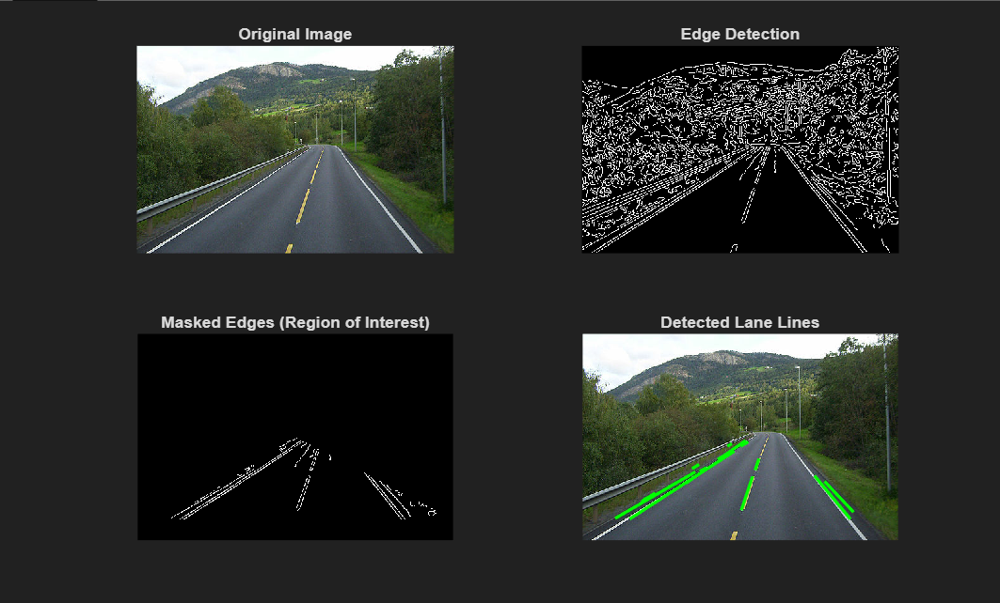

# 🛣️ Lane Marking Detection from Road Image  

<p align="center">
  
</p>

## 📌 Project Overview  
This project detects and highlights **lane markings** from a static road image using **MATLAB** image processing techniques.  
It is useful for autonomous driving research, road safety analysis, and computer vision experiments.

---

## ✨ Features  
- 🖼 **Processes a static road image** and detects lane boundaries  
- 🎯 **Accurate lane edge detection** using filtering and edge detection algorithms  
- 🖌 **Lane markings highlighted** on the original image  
- ⚡ **Fast and lightweight** — works on single images in seconds  

---

## 🛠️ Tech Stack  
- **Language:** MATLAB  
- **Techniques Used:**  
  - Grayscale conversion  
  - Noise reduction filters  
  - Edge detection (e.g., Canny)  
  - Region of Interest (ROI) masking  
  - Line detection (Hough Transform)  

---

## 📂 Project Structure  
📁 Lane-Marking-Detection

 ├── lane_detection.m # Main MATLAB script
 
 ├── road.jpg # Input road image

 ├── output.png # Sample output with lanes marked
 
 ├── README.md # Project documentation

---

## 🚀 How to Run  
1. **Clone the repository**
  ```bash 
   git clone https://github.com/yourusername/Lane-Marking-Detection.git
   cd Lane-Marking-Detection
Open MATLAB and load the project folder
```
Run the script in MATLAB:
```matlab
lane_detection
```
📸 Output Example
<p align="center">  </p>

---

📈 Future Improvements:

-📹 Extend support for real-time video streams

-🛣 Detect curved lanes more accurately

-🚗 Combine with vehicle detection for ADAS

---

🏆 Author

Abhimanyu Sharma

💼 Electronics & Communication Engineering Student

📧 abhimanyu.sharma.2805@example.com

🔗 ## 🔗 Connect with Me
[](https://www.linkedin.com/in/abhimanyu-sharma-8749b2312)
[](https://github.com/abrrrxx)


